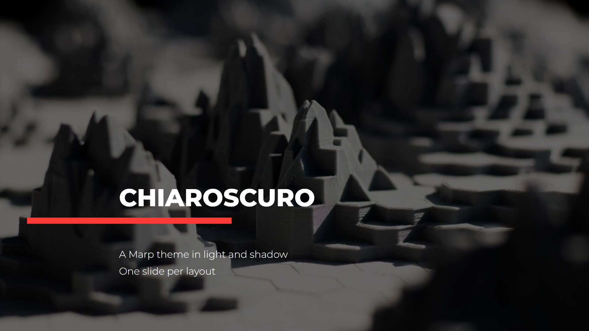
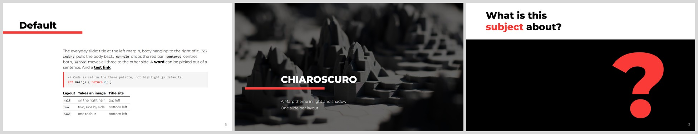
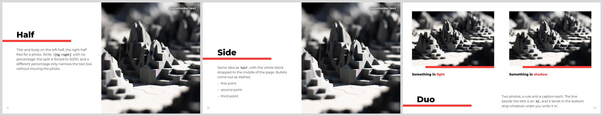
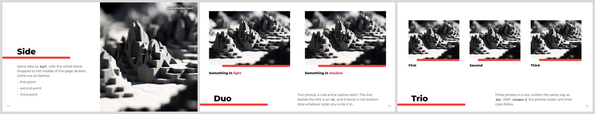
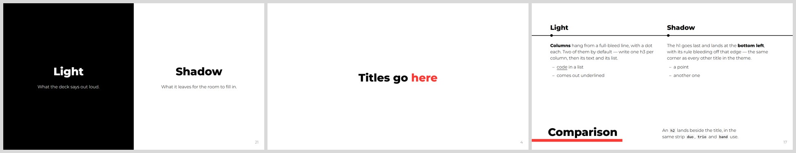
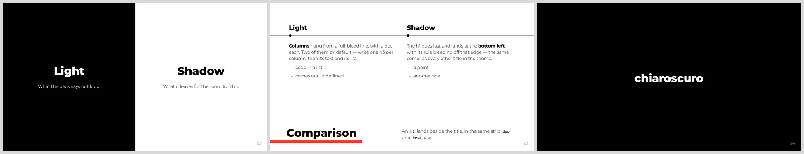
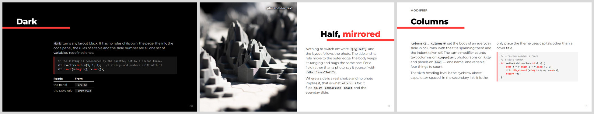
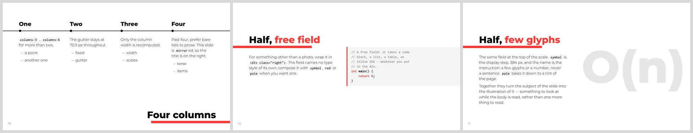
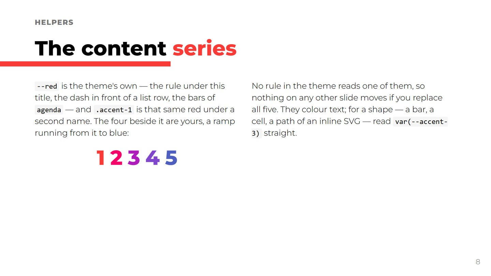

# chiaroscuro

A [Marp](https://marp.app) theme in light and shadow.



A 1920 × 1080 deck built around one idea: the talk runs in the light, and the
black slides — a question, a doubt, anything marked `dark` — are the shadows in
between. Editorial style, one red accent — and four more colours put
aside for your own diagrams — Montserrat throughout, fourteen layouts that cover
a whole talk without ever asking you to write CSS.

```text
themes/chiaroscuro.css   the theme — one file, no dependencies
example.md               one slide per layout, ready to render
assets/placeholder.jpg   the filler photo the example uses
```

## Fourteen layouts

One class directive per slide — `<!-- _class: name -->` — and nothing else to
write. Left to right; each is described in
[the documentation](DOCS.md#layouts).



<p align="center"><sub><i>(none)</i> — the everyday slide ·
<code>cover</code> — full-bleed photo over black ·
<code>question</code> — a white band, and a giant "?" in the black</sub></p>



<p align="center"><sub><code>half</code> — text left, photo right ·
<code>side</code> — <code>half</code>, dropped to the middle ·
<code>duo</code> — two photos, a rule and a caption each</sub></p>



<p align="center"><sub><code>trio</code> — three in a row, or two to six ·
<code>band</code> — a full-bleed band of image ·
<code>image</code> — one photo covering the slide</sub></p>



<p align="center"><sub><code>split</code> — half black, half white ·
<code>poster</code> — one large sentence, centred ·
<code>comparison</code> — columns hanging from a line</sub></p>



<p align="center"><sub><code>board</code> — one free field across the top ·
<code>agenda</code> — a numbered list against grey numerals ·
<code>poster dark</code> — and black, to close</sub></p>

## Modifiers

Space-separated in the same directive — `<!-- _class: half dark -->`. `dark`
turns any layout black; `mirror` moves the title to the other side; `columns-N`
counts whatever the layout counts. The rest — `centered`, `no-rule`,
`no-indent`, the type helpers — are in [the documentation](DOCS.md#modifiers).



<p align="center"><sub><code>dark</code> — any layout, turned black ·
<code>![bg left]</code> — the photo implies the side ·
<code>columns-2</code> — text columns on the everyday slide</sub></p>



<p align="center"><sub><code>comparison columns-4 mirror</code> ·
<code>&lt;div class="right"&gt;</code> — the free field takes code ·
<code>.symbol .pale</code> — the subject as the illustration</sub></p>

## Install

Copy [`themes/chiaroscuro.css`](themes/chiaroscuro.css) into your project and
register it with the tool you use:

- **marp-cli** — a `.marprc.yml` next to where you run it:

  ```yaml
  themeSet: ./themes
  allowLocalFiles: true
  ```

  or point at the file directly: `marp deck.md --theme themes/chiaroscuro.css`.

- **Marp for VS Code** — in `.vscode/settings.json`:

  ```json
  { "markdown.marp.themes": ["./themes/chiaroscuro.css"] }
  ```

If a render comes out in Segoe UI with blue headings on a small canvas, the
theme silently failed to register — [the documentation](DOCS.md#install) walks
through each channel and its quirks.

## Quick start

```markdown
---
marp: true
theme: chiaroscuro
paginate: true
---

<!-- _class: cover -->
<!-- _paginate: false -->


# Title

Subtitle
Author

---

# An ordinary slide

The title starts at the left margin with its red rule bleeding off the edge,
and the body hangs to the right of it.
```

Or render the example deck — one slide per layout — from the repository root:

```bash
marp example.md --pdf -o example.pdf
```

## What else it does

- **Five accent colours for your own content.** A ramp from the theme's red to
  a blue, every step at least 3.7 : 1 against white *and* against black, and no
  rule in the theme reads any of them — replace all five and nothing moves.

  

- **SVG diagrams adapt to the ground.** Draw a figure once, in the light
  palette; on the black layouts the theme inverts it and turns the hues back
  around, so one file serves both grounds.
- **Six line weights for your own diagrams.** A `--sw-*` scale beside the type
  and colour ones, read straight from a shape — `stroke-width="var(--sw-medium)"`
  — so a drawing is set on the theme's steps rather than on numbers invented
  beside it. As with the accents, no rule in the theme reads them.
- **Montserrat is embedded in the CSS.** Composing and exporting need neither
  an internet connection nor installed fonts; the HTML and PDF you export are
  self-contained.
- **A fixed 1920 × 1080 px geometry.** Every decision — palette, type scale,
  spacing, weights — is a variable in the first two hundred lines of the file,
  made to be forked.

## Documentation

Everything above, in full — how to write each layout, the modifiers, the type
helpers, the accent series and its contracts, photograph credits, exporting —
is in **[DOCS.md](DOCS.md)**.

## Licence

The theme is MIT licensed. Montserrat is under the SIL Open Font License 1.1.
`assets/placeholder.jpg` is filler for the example deck only — replace it with
your own before you publish anything.
