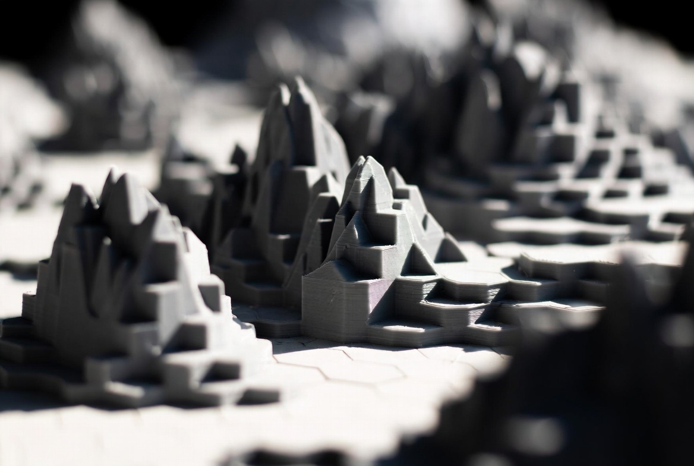

<!-- _class: cover -->
<!-- _paginate: false -->



# Chiaroscuro

A Marp theme in light and shadow
One slide per layout

---

<!-- _class: agenda -->

# Contents

1. Fourteen layouts, one slide each
2. Modifiers, named as they come up
3. Nothing here you have to write CSS for

---

<!-- _class: question -->

# What is this<br>**subject** about?

---

<!-- _class: poster -->

Titles go **here**

---

# Default

The everyday slide: title at the left margin, body hanging to the right of it. `no-indent` pulls the body back, `no-rule` drops the red bar, `centered` centres both, `mirror` moves all three to the other side. A **word** can be picked out of a sentence. And a [test link](https://github.com/mressl-itba/chiaroscuro).

```cpp
// Code is set in the theme palette, not highlight.js defaults.
int main() { return 0; }
```

| Layout | Takes an image | Title sits |
| --- | --- | --- |
| `half` | on the right half | top left |
| `duo` | two, side by side | bottom left |
| `band` | one to four | bottom left |

---

<!-- _class: columns-2 -->

# Columns

###### Modifier

`columns-2` … `columns-6` set the body of an everyday slide in columns, with the title spanning them and the indent taken off. The same modifier counts text columns on `comparison`, photographs on `trio` and panels on `band` — one name, one variable, four things to count.

The sixth heading level is the eyebrow above: caps, letter-spaced, in the secondary ink. It is the only place the theme uses capitals other than a cover title.

<div class="xsmall">

```cpp
// --fs-code reaches a fence
// a class cannot.
int median(std::vector<int>& v) {
    auto m = v.begin() + v.size() / 2;
    std::nth_element(v.begin(), m, v.end());
    return *m;
}
```

</div>

---

# The content **series**

###### Helpers

`--red` is the theme's own — the rule under this title, the dash in front of a list row, the bars of `agenda` — and `.accent-1` is that same red under a second name. The four beside it are yours, a ramp running from it to blue:

<div class="extralarge">

<span class="accent-1">**1**</span> <span class="accent-2">**2**</span> <span class="accent-3">**3**</span> <span class="accent-4">**4**</span> <span class="accent-5">**5**</span>

</div>

No rule in the theme reads one of them, so nothing on any other slide moves if you replace all five. They colour text; for a shape — a bar, a cell, a path of an inline SVG — read `var(--accent-3)` straight.

---

<!-- _class: half -->
<!-- _footer: placeholder text -->

# Half

Title and body on the left half, the right half free for a photo. Write `![bg right]` with no percentage: the split is forced to 50/50, and a different percentage only narrows the text box without moving the photo.


---

<!-- _class: half -->

# Half, **free field**

For something other than a photo, wrap it in `<div class="right">`. The field carries no type style of its own; compose it with `huge`, `red` or `pale` when you want one.

<div class="right">

```cpp
// A free field: it takes a code
// block, a list, a table, an
// inline SVG — whatever you put
// in the div.
int main() {
    return 0;
}
```

</div>

---

<!-- _class: half -->

# Half, **few glyphs**

The same field at the top of the scale. `huge` is the display step, 384 px, meant for a few glyphs or numbers and never for a sentence; `pale` takes it down to a tint of the page.

Together they turn the subject of the slide into the illustration of it — something to look at while the body is read, rather than one more thing to read.

<div class="right huge pale">

O(n)

</div>

---

<!-- _class: half -->
<!-- _footer: placeholder text -->

# Half, **mirrored**

Nothing to switch on: write `![bg left]` and the layout follows the photo. The title and its rule move to the outer edge, the body keeps its ranging and hugs the same one. For a field rather than a photo, say it yourself with `<div class="left">`.

Where a side is a real choice and no photo implies it, that is what `mirror` is for: it flips `split`, `comparison`, `board` and the everyday slide.


---

<!-- _class: side -->
<!-- _footer: placeholder text -->

# Side

Same idea as `half`, with the whole block dropped to the middle of the page. Bullets come out as dashes:

- first point
- second point
- third point


---

<!-- _class: duo -->

# Duo

## Two photos, a rule and a caption each. The line beside the title is an `h2`, and it lands in the bottom strip whatever order you write it in.

#### Something in **light**


#### Something in **shadow**


---

<!-- _class: trio -->

# Trio

## Three photos in a row, written the same way as `duo`. With `columns-2` the photos widen and their rules follow.

#### First


#### Second


#### Third


---

<!-- _class: band -->
<!-- _footer: placeholder text -->

# Band

## A full-bleed band of image across the top, and the same footing as `duo` and `trio` below it. With `columns-2` … `columns-4` the band is shared edge to edge, with no gutter.


---

<!-- _class: image -->
<!-- _footer: placeholder text -->

# Image


---

<!-- _class: comparison -->

# Comparison

## An `h2` lands beside the title, in the same strip `duo`, `trio` and `band` use.

### Light

**Columns** hang from a full-bleed line, with a dot each. Two of them by default — write one h3 per column, then its text and its list.

- `code` in a list
- comes out underlined

### Shadow

The h1 goes last and lands at the **bottom left**, with its rule bleeding off that edge — the same corner as every other title in the theme.

- a point
- another one

---

<!-- _class: comparison columns-4 mirror -->

# Four columns

### One

`columns-3` … `columns-6` for more than two.

- a point
- another one

### Two

The gutter stays at 70.5 px throughout.

- fixed
- gutter

### Three

Only the column width is recomputed.

- width
- scales

### Four

Past four, prefer bare lists to prose. This slide is `mirror`ed, so the title is on the right.

- terse
- items

---

<!-- _class: board wide large -->

# Board

## One free field, with the title of `comparison` under it and an `h2` beside it. The table keeps its own width — `wide` would stretch it to the field's.

| Edge | Borrowed from |
| --- | --- |
| left and right | the left margin of `half`, and its mirror |
| top and bottom | the band of photograph on `band` |

---

<!-- _class: dark -->

# Dark

`dark` turns any layout black. It has no rules of its own: the page, the ink, the code panel, the rules of a table and the slide number are all one set of variables, redefined once.

```cpp
// The listing is recoloured by the palette, not by a second theme.
std::vector<int> v{3, 1, 2};   // strings and numbers shift with it
std::sort(v.begin(), v.end());
```

| Reads | From |
| --- | --- |
| the panel | `--pre-bg` |
| the table rule | `--gray-rule` |

---

<!-- _class: split -->

# Light

What the deck says out loud.

# Shadow

What it leaves for the room to fill in.

---

<!-- _class: poster dark -->

chiaroscuro
